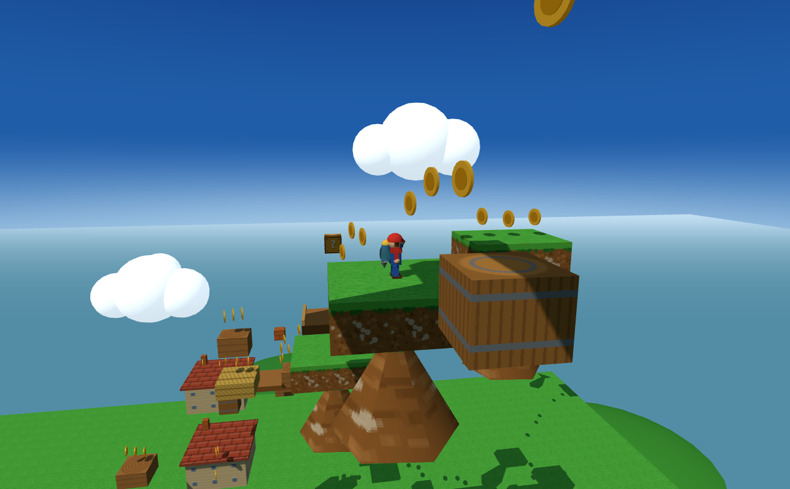
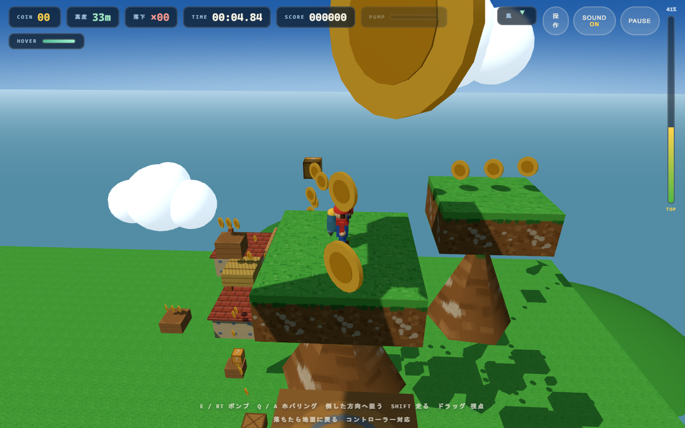
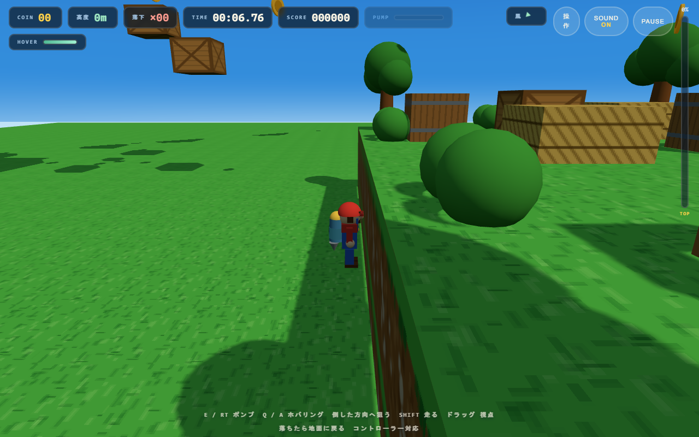

# SUPER HOP — そらへのぼる町

three.jsだけで作った、**ジャンプのない**3Dアクションゲームです。上へ行く手段は背中の「すいとりポンプ」だけ。
押しっぱなしでチャージ、離すと身長10体分（17m）打ち上がります。作りこんだ1本（81m）を、何度も登り直すゲームです。



- 遊ぶ: https://hs329.github.io/super-hop/ （GitHub Pages。組み出しは gh-pages ブランチに置いてあります。更新は `npm run gh:deploy`）

| | |
| --- | --- |
 |  |

## 何ができるゲームか

- いちばん下の地面から始まります。木箱・藁・樽・切り株・屋根の5段を渡るチュートリアルで操作を覚え、町の広場へ出ます
- 家根、木箱、浮島、岩棚、雲を伝わって81m上の頂上へ。本道23ホップに加えて横道が9本、まわりの「乗れるもの」を渡っていく1面です
- **空中で一度だけ、1秒だけホバリング**できます。届かない1mを稼ぐための呼吸。着ると戻ります
- 外しても死にません。いちばん下の地面まで落ちて、そこに立つだけ（落下回数はスコアに効きます）
- 空中では風が実際の力として効きます。高度に応じて空の色が変わる
- 表示は日本語 / English（`L`で切替）。ゲームパッドは接続するだけで動きます

モデルも画像も音も、すべてコードで生成しています。外部アセットはゼロです。

## 起動手順

Node.js 20.19以降（または22.12以降）と、WebGL対応のブラウザが必要です。

```bash
npm install
npm run dev:hop      # http://127.0.0.1:5175/platformer/ が開きます
```

組み出して単体フォルダーにする（`share/super-hop/` に `index.html` と `assets/` だけ）:

```bash
npm run build
npm run pack:hop     # share/super-hop/ と share/SUPER-HOP.zip
npm run serve:pack   # http://127.0.0.1:5177/ で試す
```

Windowsの `.exe` にすることもできます（Chromiumを同梱せず、WindowsのWebView2を呼ぶ薄い皮。約0.9MB）:

```bash
npm run exe          # dist-exe/win/SUPER-HOP.exe
npm run verify:exe   # exe同梱のweb/を、exe自身のサーバーで起動検査
```

## 操作

| 入力 | 動作 |
| --- | --- |
| WASD / 矢印 | 移動（常に画面の向き基準） |
| E / Space / RT | ポンプ。押しっぱなしでチャージ、離すと発射（満タンで17m） |
| 移動キー | 空中では舵。溜めている間は倒した方向に体が傾き、高さとの交換になる |
| Q / A | ホバリング（空中で一度だけ、1秒） |
| Shift / LB・LT | 走る |
| マウスドラッグ / 右スティック | 視点 |
| ホイール / 右スティックX | ズーム |
| B | 視点を戻す |
| L / X | 表示言語の切替 |
| M | 音のON/OFF |
| Esc / Start | ポーズ |
| F11 | フルスクリーン（.exe版） |

## 検査

```bash
npm run check:climb    # 面そのものの設計検査（ブラウザ不要。全47足場に届くかを総当たりで解く）
npm run verify:hop     # 実プレイ検査（起動→チュートリアル→ポンプ17m→ホバリング→頂上まで）
npm run verify:pack    # 単体フォルダーで動くかの検査（先に npm run serve:pack）
```

`verify:hop` はPlaywrightを使います。`npx playwright install chromium` か、既存のChromeを指すなら `HOP_BROWSER=C:\path\to\chrome.exe` を指定してください。

ゲーム内部を読むだけの診断APIとして `window.__HOP__.snapshot()` があります（状態は変えません）。面の設計・物理の数値・ホバリングの仕様・言語の仕組みなどは [platformer/README.md](platformer/README.md) に書いています。

## サイトを更新する

https://hs329.github.io/super-hop/ は **gh-pages ブランチ**（組み出し済みの `index.html` と `assets/`）をそのまま配信しています。main にpushしてもサイトは変わらないので、反映させたいときは:

```powershell
$env:GH_TOKEN = "ghp_……"   # repo スコープのトークンで足ります（workflow スコープは不要）
npm run gh:deploy           # build → pack:hop → gh-pages へ force push → Pagesが自動で再デプロイ
```

Pagesの設定は Settings → Pages → "Deploy from a branch" / `gh-pages` / `root` です（Actionsは使っていません）。

## 依存

- [three.js](https://threejs.org/) と Vite のみ。画像・音源・3Dモデル・セーブデータなし（BGMと効果音はWebAudioで合成した波形、テクスチャはCanvas生成）

これは1本の面のプロトタイプです。2本目の面、タッチ端末用の仮想ボタンは含みません。
